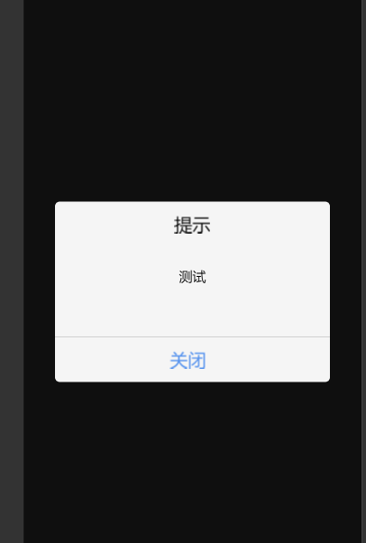

# cocos-creator-alert

this is a component write for cocos-creator. it can run on android and ios both. using javaScript only, without any other dependences.

- 1、import      
- 
      import Alert from './Alert'
- 2、use    
- 
      Alert.show('提示', '测试')

- 3、more
 
######  you can set some button and callBack Function to this component, just like this. actually, it's not neccessary
      Alert.show('title', 'message', {name:'name1', callBack: Function1})

- 4、UI set    
- 
	   Alert.setWidth(width: number)

#中文

- ------
  这是为cocos -creator 写的一个组件。全程只用了javaScript(typeScript). 只有1个文件，没有其他任何依赖，可以直接在andriod 和 ios 中运行
- 使用方法
- 1、引入
-   
      import Alert from './Alert';
- 2、使用    
-
      Alert.show('标题', '文本信息');

- 3、更多使用     
- 
###### 可以在show 方法内传入可选参数实现按钮自定义，以及按钮回调方法的自定义。 示意如下：
-
       Alert.show('title', 'message', {name: 'name1'， callBack: Function1})

- 4、 样式 设置 
-   
###### 你可以调用一下提供的ui方法进行样式设定。例如：
-    
       Alert.setWidth(width: number);

